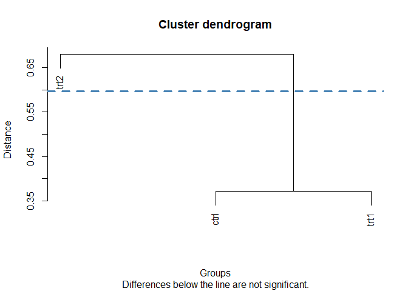
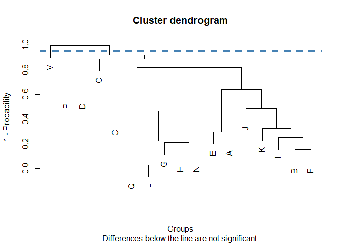

<!-- README.md is generated from README.Rmd. Please edit that file -->

# ClustMC

<!-- badges: start -->

[](https://github.com/SGS2000/ClustMC/actions/workflows/R-CMD-check.yaml)
[](https://app.codecov.io/gh/SGS2000/ClustMC)
[](https://lifecycle.r-lib.org/articles/stages.html#experimental)

<!-- badges: end -->

🇬🇧 ClustMC implements cluster-based multiple comparisons tests. These
tests apply clustering techniques to group the means of different
treatments into non-overlapping clusters, with treatments considered
statistically different if they are in separate groups.

All tests included in the package share similar features:

- Inspired by the [agricolae](https://myaseen208.com/agricolae/)
  package, it is possible to work with either two vectors (one for the
  response variable and one for the treatments) or a model (created with
  `lm()` or `aov()`). In the latter case, the name of the variable with
  the treatments must be specified.
- After applying the corresponding method, a table containing the
  treatments and their group (indicated by a number) is printed to the
  console. Treatments within the same group are not significantly
  different. The user can choose not to display the table.
- By default, a dendrogram is plotted. The dendrogram can be customized
  with any argument passed to the `plot()` function. In addition, the
  data used to create the plot is made available to the user, so it is
  possible to use other libraries such as ggplot2.

------------------------------------------------------------------------

🇪🇸 ClustMC implementa pruebas de comparaciones múltiples basadas en
conglomerados. Estas pruebas aplican técnicas de *clustering* para
agrupar las medias de los distintos tratamientos en conglomerados no
superpuestos, considerándose los tratamientos estadísticamente
diferentes si se encuentran en grupos separados.

Todos los tests incluidos en el paquete tienen características
similares:

- Basándose en el paquete
  [agricolae](https://myaseen208.com/agricolae/), es posible trabajar
  con dos vectores (uno para la variable respuesta y otro para los
  tratamientos) o con un modelo (creado con `lm()` o `aov()`). En el
  segundo caso, se debe indicar el nombre de la variable con los
  tratamientos a comparar.
- Luego de aplicar el método correspondiente, se imprime en la consola
  una tabla con los tratamientos y el grupo al que han sido asignados
  (indicado por un número). Los tratamientos dentro del mismo grupo no
  son significativamente diferentes. Se puede optar por no mostrar estos
  resultados.
- Por defecto, se grafica un dendrograma. El dendrograma puede ser
  personalizado con cualquier argumento de la función `plot()`. Además,
  el usuario tiene acceso a los datos usados para crearlo, por lo que es
  posible recurrir a otros paquetes como ggplot2.

## Installation / Instalación

The package can be installed from CRAN: / El paquete puede instalarse
desde CRAN:

``` r
install.packages("ClustMC")
```

The development version is available from GitHub: / La versión en
desarrollo está disponible en GitHub:

``` r
remotes::install_github("SGS2000/ClustMC")
```

## Examples / Ejemplos

### Tests

🇬🇧 The following example applies the Di Rienzo, Guzmán, and Casanoves
test to evaluate whether there are significant differences between the
yields obtained under a control and two different treatment conditions.
In this case, vectors are passed as arguments.

🇪🇸 El siguiente ejemplo aplica la prueba de Di Rienzo, Guzmán y
Casanoves para evaluar si existen diferencias significativas entre los
rendimientos obtenidos bajo una condición de control y dos condiciones
de tratamiento diferentes. En este caso, se pasan vectores como
argumentos.

``` r
library(ClustMC)

data(PlantGrowth)
plants_weights <- PlantGrowth$weight
plants_trt <- PlantGrowth$group

dgc_test(y = plants_weights, trt = plants_trt)
```



    #>      group
    #> ctrl     1
    #> trt1     1
    #> trt2     2
    #> Treatments within the same group are not significantly different

------------------------------------------------------------------------

🇬🇧 In the following example, a dataset with results from a bread-baking
experiment is used. An ANOVA model is fitted, with the volume of the
loaves as a response variable and the amount of potassium bromate and
the variety of wheat as explanatory variables. The Jolliffe test is then
applied to evaluate differences between the 17 varieties.

🇪🇸 En el siguiente ejemplo, se utiliza un dataset con los resultados de
un experimento de panadería. Se ajusta un modelo ANOVA con el volumen de
los panes como variable respuesta y la cantidad de bromato de potasio y
la variedad de trigo como variables explicativas. La prueba de Jolliffe
se aplica luego para evaluar las diferencias entre las 17 variedades.

``` r
library(ClustMC)

data(bread)
anova_model <- aov(volume ~ variety + as.factor(bromate), data = bread)

jolliffe_test(y = anova_model, trt = "variety")
```



    #>   group
    #> M     1
    #> P     2
    #> D     2
    #> C     2
    #> Q     2
    #> L     2
    #> H     2
    #> G     2
    #> N     2
    #> B     2
    #> F     2
    #> I     2
    #> K     2
    #> J     2
    #> E     2
    #> A     2
    #> O     2
    #> Treatments within the same group are not significantly different

### Customizing plots / Personalizar gráficos

🇬🇧 Dendrograms can be customized, using any argument available for the
`plot()` function. In the case of the lines, arguments for the
`abline()` function must be passed as list. For a detailed explanation
and examples, check `vignette("CustomPlots")`.

🇪🇸 Los dendrogramas pueden ser personalizados, utilizando cualquier
argumento disponible para la función `plot()`. En el caso de las líneas
rectas, se debe utilizar una lista conteniendo argumentos para la
función `abline()`. Para ver una explicación detallada y ejemplos,
revise `vignette("CustomPlots")`.
